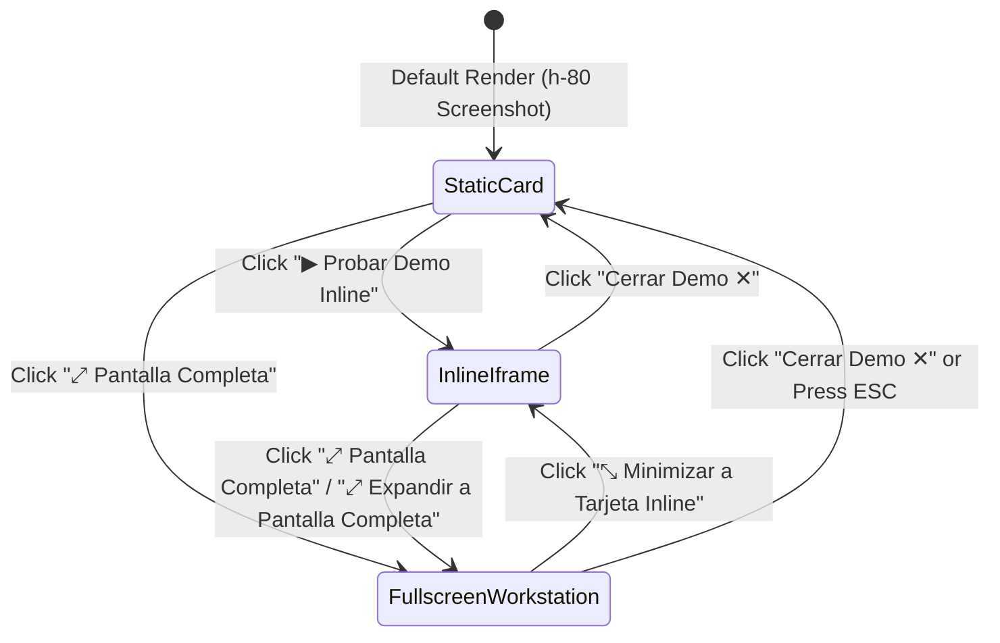

# UI/UX Design Specification: Portfolio System (`/portafolio`)

**Target Repository:** `sebastian-gomez-site` (`c:\Users\Usuario\Documents\mis repositorios\sebastian-gomez-site`)  
**Date:** 2026-10-07  
**Status:** Iterated & Approved — 100% Aligned with `sebastian-gomez-site` Production UI (Dual Demo Mode + Top Sidebar Filter)  
**Stitch Project ID:** `18066972579938045535`  
**Stitch Project Resource:** `projects/18066972579938045535`  

---

## 1. Executive Summary & Iterated Refinements

Following user validation, the Stitch UI/UX design for `/portafolio` incorporates:
1. **1:1 Visual Fidelity with `sebastian-gomez-site`:**
   - Vibrant royal/cyan blue geometric background ([`public/bg.webp`](file:///c:/Users/Usuario/Documents/mis%20repositorios/sebastian-gomez-site/public/bg.webp) + [`styles/globals.scss`](file:///c:/Users/Usuario/Documents/mis%20repositorios/sebastian-gomez-site/styles/globals.scss)) and `'Montserrat', sans-serif` typography.
   - Transparent Header ([`components/Header.jsx`](file:///c:/Users/Usuario/Documents/mis%20repositorios/sebastian-gomez-site/components/Header.jsx) + [`components/CategoryList.jsx`](file:///c:/Users/Usuario/Documents/mis%20repositorios/sebastian-gomez-site/components/CategoryList.jsx)) with bold white `Sebastian Gomez` on the left and `About`, `Conferencias`, `Portafolio`, plus the 3-bar hamburger menu `☰` on the right (`border-b border-blue-400 py-8`).
   - Canonical `8 + 4` 12-column grid (`grid-cols-1 lg:grid-cols-12 gap-12`) with pure white project cards (`bg-white shadow-lg rounded-lg p-0 lg:p-8 pb-12 mb-8`) modeled directly on [`components/PostCard.jsx`](file:///c:/Users/Usuario/Documents/mis%20repositorios/sebastian-gomez-site/components/PostCard.jsx).
2. **Dual Interactive Demo Mode (Inline Card + Fullscreen Expanded Card):**
   - Each embeddable project card offers two direct interactive triggers alongside the repository link:
     - **`▶ Probar Demo Inline`** (`bg-pink-600 text-white rounded-full px-6 py-3`): Replaces the static top image (`h-80`) inside the white card with an inline interactive `<iframe>` and a toolbar containing `⤢ Pantalla Completa` and `Cerrar Demo ✕`.
     - **`⤢ Pantalla Completa`** (`border-2 border-pink-600 text-pink-600 hover:bg-pink-50 rounded-full px-6 py-3`): Expands the white project card across the full 12-column container width (`col-span-12`) with a `750px+` tall interactive `<iframe>` viewport, device switcher (`Desktop | Tablet | Móvil`), quick prev/next project navigation, and a **`⤡ Minimizar a Tarjeta Inline`** button to return smoothly to the 8-column inline view.
3. **Sidebar Widget Order (`lg:col-span-4` on Desktop, stacked below pagination on Mobile):**
   - **1st Position (Top):** **`Categorías`** filter card (`Todos los Proyectos (32)`, `Demos Interactivas (27)`, `AI & Machine Learning (5)`, `Angular & Ionic (11)`, `MusicTech & WebAudio (8)`, `React & Next.js (14)`), styled identically to [`components/Categories.jsx`](file:///c:/Users/Usuario/Documents/mis%20repositorios/sebastian-gomez-site/components/Categories.jsx).
   - **2nd Position (Middle):** **`SiteWidget`** ([`components/SiteWidget.jsx`](file:///c:/Users/Usuario/Documents/mis%20repositorios/sebastian-gomez-site/components/SiteWidget.jsx) with `160x160 rounded-full` avatar of Sebastian Gomez, justified bio, and social icons).
   - **3rd Position (Bottom):** **`Recent Posts`** ([`components/PostWidget.jsx`](file:///c:/Users/Usuario/Documents/mis%20repositorios/sebastian-gomez-site/components/PostWidget.jsx)).

---

## 2. Stitch Project & Iterated High-Fidelity Screen Inventory

| Screen # | Title / View State | Device | Dimensions | Stitch Screen ID | Local Asset Path |
|---|---|---|---|---|---|
| **Screen 1** | Desktop Main Paginated Feed (Categorías Top + Dual Demo Buttons) | `DESKTOP` | `2560 × 7898` | `27f34fc75b814f00a3f638dfbba0bdf8` | [`docs/portfolio/assets/stitch_screen1_desktop.png`](file:///c:/Users/Usuario/Documents/mis%20repositorios/sebastian-gomez-site/docs/portfolio/assets/stitch_screen1_desktop.png) |
| **Screen 2** | Desktop Inline Live-Embed State (with `⤢ Pantalla Completa` toggle) | `DESKTOP` | `2560 × 5252` | `0030732f9f174306a7ece2edf51baa95` | [`docs/portfolio/assets/stitch_screen3_modal.png`](file:///c:/Users/Usuario/Documents/mis%20repositorios/sebastian-gomez-site/docs/portfolio/assets/stitch_screen3_modal.png) |
| **Screen 3** | Desktop Fullscreen Expanded Demo State (with `⤡ Minimizar a Tarjeta Inline`) | `DESKTOP` | `2560 × 2760` | `c147f4cfdf9d483b891faf299901f688` | [`docs/portfolio/assets/stitch_screen4_fullscreen.png`](file:///c:/Users/Usuario/Documents/mis%20repositorios/sebastian-gomez-site/docs/portfolio/assets/stitch_screen4_fullscreen.png) |
| **Screen 4** | Mobile Responsive View (`390px` — Dual Demo Buttons + Categorías First) | `MOBILE` | `2560 × 6654` | `6caee0d875244f22add6d2b070fdaa16` | [`docs/portfolio/assets/stitch_screen2_mobile.png`](file:///c:/Users/Usuario/Documents/mis%20repositorios/sebastian-gomez-site/docs/portfolio/assets/stitch_screen2_mobile.png) |

---

## 3. State Machine for Dual Demo Mode (`previewMode`: `'static' | 'inline' | 'fullscreen'`)

